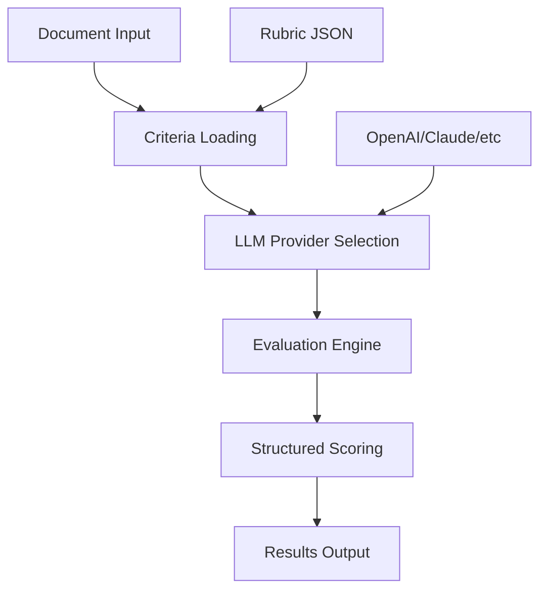

# LLM as a Judge

A comprehensive framework for evaluating documents using Large Language Models as judges.

## Overview

LLM as a Judge is a Python framework that enables systematic evaluation of documents, essays, reports, and other textual content using state-of-the-art language models. The framework provides structured evaluation criteria, multiple LLM provider support, and comprehensive scoring mechanisms.

## Key Features

- **Multiple LLM Providers**: Support for OpenAI GPT models, Anthropic Claude, and other providers
- **Structured Evaluation**: XML-based criteria definition with customizable scoring rubrics
- **Batch Processing**: Evaluate multiple documents efficiently
- **CLI Interface**: Command-line tools for easy integration into workflows
- **Extensible Architecture**: Easy to add new criteria and evaluation methods
- **Pydantic AI Integration**: Modern AI framework integration for robust evaluations

## Quick Start

Get started with a simple evaluation in just a few steps:

```bash
# Install the package
pip install -r requirements.txt

# Run your first evaluation
python -m src.cli --document "Your document text here" --rubric tests/rubric.json
```

## Use Cases

- **Academic Assessment**: Evaluate student essays and assignments
- **Content Quality**: Assess blog posts, articles, and documentation
- **Research Evaluation**: Score research papers and reports
- **Business Documents**: Evaluate proposals, reports, and presentations

## Architecture



## Getting Started

Ready to start evaluating? Check out our guides:

- [Installation Guide](installation.md) - Set up your environment
- [Quick Start Tutorial](quickstart.md) - Your first evaluation in 5 minutes
- [Creating Rubrics](usage/rubrics.md) - Define your evaluation criteria

## Community

- 🐛 [Report Issues](https://github.com/takuyakubo/llm-as-a-judge/issues)
- 💡 [Feature Requests](https://github.com/takuyakubo/llm-as-a-judge/issues)
- 📖 [Documentation](https://takuyakubo.github.io/llm-as-a-judge)
- 🔗 [GitHub Repository](https://github.com/takuyakubo/llm-as-a-judge)